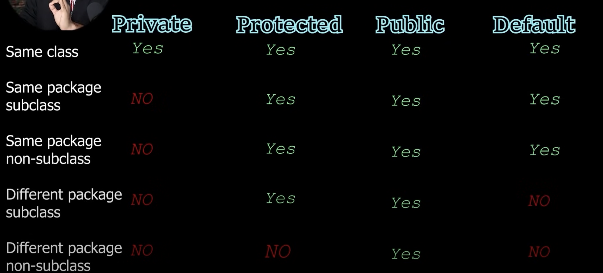

# **Reference Video** -

https://www.youtube.com/watch?v=BGTx91t8q50

# **JDV,JRE,JVM**

To compile java code we need a tool called JDK.
JVM is the machine which runs the code
JVM is the space where bytecode is executed
JRE= some lib/inbuilt classes + JVM
when you instal the jdk , you get the updated JRE and the JVM , and by default you will have JRE,JVM on their machines

1. Java Development Kit (JDK)
   Definition: A comprehensive software development kit used for developing Java applications.
   Components:
   JRE: Includes the JVM and standard libraries.
   Java Compiler (javac): Converts Java source code to bytecode.
   Java Debugger (jdb): A tool for debugging Java applications.
   Java Documentation Tool (javadoc): Generates documentation from Java source code.
   Java Archive Tool (jar): Packages Java classes and resources into a JAR file.
   Purpose: Used by developers to write, compile, and debug Java applications.

2. Java Runtime Environment (JRE)
   Definition: Provides the environment necessary to run Java applications.
   Components:
   JVM: The engine that executes Java bytecode.
   Standard Libraries: Java API classes needed at runtime (e.g., java.lang, java.util).
   Configuration Files: Files that configure the JVM.
   Purpose: Used by end-users to run Java applications. It does not include development tools.

3. Java Virtual Machine (JVM)
   Definition: An abstract machine that executes Java bytecode and provides platform independence.
   Components:
   Class Loader: Loads class files into memory.
   Bytecode Verifier: Checks the integrity of bytecode.
   Execution Engine: Executes bytecode, using either interpretation or Just-In-Time (JIT) compilation.
   Garbage Collector: Manages memory by reclaiming unused objects.
   Purpose: Executes Java bytecode and provides the runtime environment for Java applications.
   Summary
   JDK (Java Development Kit): The full suite of tools needed for Java development, including the JRE and additional tools like the compiler and debugger.
   JRE (Java Runtime Environment): Provides the JVM and standard libraries needed to run Java applications.
   JVM (Java Virtual Machine): Executes Java bytecode and manages memory. It is the core component for running Java applications on different platforms.

**JIT** J
IT stands for Just-In-Time and it is used _for improving the performance during run time_. It does the task of _compiling parts of byte code having similar functionality at the same time_ thereby reducing the amount of compilation time for the code to run.
'
The compiler is nothing but a translator of source code to machine-executable code. But what is special about the JIT compiler? Let us see how it works:
-First, the Java source code (.java) conversion to byte code (.class) occurs with the help of the javac compiler.
-Then, the .class files are loaded at run time by JVM and with the help of an interpreter, these are converted to machine understandable code.
-JIT compiler is a part of JVM. When the JIT compiler is enabled, the _JVM analyzes the method calls in the .class files and compiles them to get more efficient and native code. It also ensures that the prioritized method calls are optimized._
-Once the above step is done, the JVM executes the optimized code directly instead of interpreting the code again. This increases the performance and speed of the execution.

Class is a blueprint

1. Class
   Definition: A class is a blueprint or template for creating objects. It defines a type of data structure that contains methods (functions) and attributes (fields or properties) that its objects will have.

Components:

Fields (Attributes): Variables that hold the state or data of the class.
Methods: Functions that define the behavior or actions of the class.
Constructors: Special methods used to initialize objects of the class.
Access Modifiers: Keywords (e.g., public, private) that define the visibility of class members.
Purpose: To define and encapsulate the properties and behaviors of objects.

2. Object
   Definition: An object is an instance of a class. It represents a specific realization of a class and encapsulates both data (attributes) and behavior (methods).

Characteristics:

State: Defined by the values of the object’s attributes.
Behavior: Defined by the methods that can be invoked on the object.
Identity: Each object has a unique identity that distinguishes it from other objects, even if they are of the same class and have the same state.
Purpose: To create and manipulate instances of a class, utilizing its attributes and methods

# **Method Overloading**

Methods with same name but different parameters
Why need it? =lets say you have a function add(n1,n2,n2) - this has 3 params and will have 3 numbers
but what if you wan to add 2 number. One solution is the make a fn with 2 params but that will be hectic as more code and
every function will have to be documented, therefore overload the methods with same method name but with different parameters

# **Stack and heap**

stack=LIFO . Every method will have its own stack
Heap memory expands
local variables are part of stack
instance variable are part of heap

\***\*Stack Memory\*\***
Purpose: Used for static memory allocation and execution of a thread. It holds local variables, method calls, and references to objects in the heap.
Lifespan: Variables in the stack exist only as long as the method that created them is running. When the method completes, the stack frame is removed and the memory is freed.
Size: Generally smaller and limited in size compared to heap memory. The size is determined at the start of the program.
Access: Memory allocation and deallocation are done automatically when methods are called and return, respectively. It follows a Last In First Out (LIFO) principle.
Performance: Faster access compared to heap memory due to its managed and predictable nature.

**\***Heap Memory**\***
Purpose: Used for dynamic memory allocation where objects and instance variables are stored. The heap is shared among all threads in a Java application.
Lifespan: Objects in the heap live until they are no longer referenced and are garbage collected.
Size: Typically larger than stack memory and can grow as needed, subject to the limits imposed by the JVM and the system.
Access: More complex and slower access compared to stack memory due to dynamic memory management and garbage collection.
Performance: Slower access compared to stack memory because of the overhead of memory management.

# **Local and instance variable**

class Calculator{
int num ->instance variable (belong to class and not a method)
public int add(int a,int b){
return a+b; ->local variable (belong to the method)
}

}

# **Array**

Arrays are fundamental data structures in programming that are used to store collections of elements,
typically of the same data type, in a contiguous block of memory.
syntax- int num[]={1,32}; / int num[]=new int[4];
Array in java is an object. It will be stored in the heap memory
Drawbacks-
-size cannot be expanded because size is fixed
-for searching,traversing,inserting it takes a lot of time as it has to go through every elements

-

# **Jagged Array**

A jagged array, also known as an "array of arrays," is an array whose elements are arrays themselves, and these inner arrays can have different lengths.
This is in contrast to a multidimensional array, where each dimension has a uniform size.
int[][] jaggedArray = new int[3][]; // Declare a jagged array with 3 rows
Initializing jagged array-
jaggedArray[0] = new int[2]; // First row has 2 columns
jaggedArray[1] = new int[4]; // Second row has 4 columns
jaggedArray[2] = new int[3]; // Third row has 3 columns

# **enhanced loop/ for each loop**

It is a simplified version of the traditional for loop in Java. It is specifically designed for iterating over arrays and collections,
providing a more readable and concise syntax.
syntax-
for (type element : collection) {
// Use the element
}
Key Features and Benefits-
Readability: The enhanced for loop provides a clear and concise way to iterate over collections and arrays, improving code readability.
Type Safety: It helps prevent common errors such as off-by-one errors and incorrect index handling, which are more likely in traditional for loops.
No Index Variable: There is no need to manage an index variable, making the code less error-prone and easier to understand.
Limitations-
Read-Only Access: The enhanced for loop provides read-only access to the elements of the collection or array. If you need to modify the elements, you'll need to use a traditional for loop or an iterator.
Limited to Collections and Arrays: It can only be used with arrays and objects that implement the Iterable interface.
Use Cases-
Iterating Over Arrays: When you need to process each element in an array.
Iterating Over Collections: When you need to process each element in a collection, such as a list, set, or map (using entrySet for maps).
Read-Only Access: When you need to read elements without modifying them.

# **Mutable vs Immutable string**

String will be stored in string pool constant. spring pool constant is present inside heap.
Unlike String literals, StringBuffer and StringBuilder objects are stored in the heap memory.

Immutable Strings
Immutable strings are strings whose content cannot be changed once they are created. Any operation that seems to modify the string will actually create a new string.

Characteristics of Immutable Strings:
No Modification: Once a string is created, its content cannot be altered.
Thread-Safety: Immutable strings are inherently thread-safe since their state cannot be changed.
Memory Efficiency: Can be more memory efficient in certain cases, as the same immutable string can be shared across different parts of the program.
Examples: In Java, the String class is immutable.
public class ImmutableStringExample {
public static void main(String[] args) {
String str = "Hello";
str = str.concat(", World!"); // Creates a new string
System.out.println(str); // Output: Hello, World!
}
}
In the example above, the concat method creates a new string "Hello, World!" without modifying the original string "Hello"

Mutable Strings
Mutable strings are strings whose content can be changed after they are created.

Characteristics of Mutable Strings:
Modification: The content of the string can be altered without creating a new string.
Not Thread-Safe: Mutable strings are generally not thread-safe, requiring additional synchronization when accessed by multiple threads.
Memory Efficiency: Can be more memory efficient for applications that perform many modifications on strings, as no new strings are created for each modification.
Examples: In Java, StringBuilder and StringBuffer classes are mutable.
Example in Java:
public class MutableStringExample {
public static void main(String[] args) {
StringBuilder sb = new StringBuilder("Hello");
sb.append(", World!"); // Modifies the original string
System.out.println(sb.toString()); // Output: Hello, World!
}
}

Use cases  
Immutable Strings:
Use when you need thread safety without additional synchronization.
Use when the string content does not change frequently.
Suitable for keys in hash tables, constants, and method return values.

Mutable Strings:
Use when you need to modify the string content frequently.
Suitable for building strings dynamically (e.g., concatenating many pieces of text).
StringBuffer is used in multi-threaded environments, whereas StringBuilder is used in single-threaded environments.

# **Static keyword**

Static Variables:

Shared across all instances of the class.
Only one copy exists, and any modification to it by any instance is reflected across all instances.

If you make a variable static then it will be common for all the objects . We will not be having individual static variable for all the objects but a common static variable for all the object.
Lets say name variable is made static then tht name will be same for all the objects and if any change is mae to the name of 1 object then the same change will be made to the name of all the objects.
Static variables should be called with their class names and not with objects

# **Static block**

A static block, also known as a static initialization block, is a block of code in Java that is executed when the class is first loaded into memory. It is used to initialize static variables or to perform any setup that is required before the class is used. Static blocks are executed in the order they appear in the class.

Every time you load a class it will call the static block and then it will create the object

static block will be called only once irrespective of homy many object calls you make
A class can contain multiple static blocks. They are executed in the order they appear in the source code.
Advantages
Encapsulation: Encapsulates the static initialization logic in one place.
Readability: Improves code readability by grouping related initialization code together.

# **Class Loader**

In Java, the class loader is a part of the Java Runtime Environment (JRE) that dynamically loads Java classes into the Java Virtual Machine (JVM) at runtime. It is responsible for locating, loading, and verifying class files.

for a class ot load object has to be called but what if i am not calling the ojects. Will the class be called?
yes - by using Class.forName("<class name>")
The Class.forName("<class name>") method in Java is used to load a class dynamically at runtime. This method returns the Class object associated with the class or interface with the given string name. When Class.forName is called, it also causes the class to be initialized, which means that its static block (if any) is executed.

# **Static Method**

A static method in Java is a method that belongs to the class rather than to any specific instance of the class. This means that you can call a static method without creating an instance of the class. Static methods can be used to perform operations that do not depend on the state of an instance of the class.

Static Block: Used for complex static initialization. Executed once when the class is loaded.
Static Method: Used for class-level operations. Can be called multiple times without creating an instance.

Feature Static Block | Static Method
Purpose: Static initialization of a class | Perform class-level operations
Execution Time: When the class is loaded | When the method is called
Number of Executions: Once per class loading | Every time the method is called
Return Type: None | Can have a return type
Parameters: Cannot accept parameters | Can accept parameters
Access: Can access static variables and static methods | Can access static variables and static methods
Typical Use Cases: Complex static initialization, loading resources | Utility methods, factory methods, class-level operations
Syntax: static { /_ initialization code _/ } | static void methodName() { /_ code _/ }

# **Encapsulation**

class Human {
private int age;
private String name;

    public int getAge() {
        return age;
    }

    public void setAge(int age) {
        // Using 'this' to refer to the instance variable
        this.age = age;
    }

    public String getName() {
        return name;
    }

    public void setName(String name) {
        // Using 'this' to refer to the instance variable
        this.name = name;
    }

}

public class Demo {
public static void main(String[] args) throws ClassNotFoundException {
Human obj = new Human();
obj.setAge(30);
obj.setName("Reddy");
System.out.println(obj.getName() + " : " + obj.getAge());
}
}

In this version, the this keyword ensures that the instance variables age and name are correctly assigned the values passed to the setter methods, avoiding any confusion with the method parameters.

# **Constructor**

A constructor in Java is a special method that is used to initialize objects. It is called when an instance of a class is created. Constructors have the same name as the class and do not have a return type, not even void.

Key Features of Constructors
Same Name as Class: The constructor must have the same name as the class.
No Return Type: Constructors do not have a return type, not even void.
Called Automatically: Constructors are called automatically when an object is created.
Can Be Overloaded: Like regular methods, constructors can be overloaded, meaning a class can have more than one constructor with different parameters.
Types of Constructors
Default Constructor: A constructor with no parameters. If no constructors are explicitly defined in a class, the Java compiler automatically provides a default constructor.
Parameterized Constructor: A constructor with parameters, allowing you to initialize an object with specific values.

Default Constructor
If no constructor is defined in a class, the compiler provides a default constructor that initializes the object with default values.
Parameterized Constructor
A constructor that accepts parameters allows you to create objects with specific initial values.

The return type is not specified in the constructor.Its name is same as class name
Constructors help in encapsulating the creation logic of an object within the class itself. This promotes better encapsulation and data hiding by keeping the internal state of the object protected and only accessible through well-defined methods.

# **Inheritance**

In object-oriented programming (OOP), inheritance allows a class to inherit properties and methods from another class.
Single inheritance refers to a class inheriting from a single superclass.
Multilevel inheritance refers to a class inheriting from a superclass, and then another class inheriting from that subclass, forming a chain. This type of inheritance is supported directly by Java.
_Multiple inheritance refers to a class inheriting from more than one superclass. Java does not support multiple inheritance directly through classes to avoid complexity and ambiguity issues, such as the diamond problem. However, multiple inheritance can be achieved using interfaces._

A <- B single level (A is parent B is child)

A <- B <- C multilevel

Single Inheritance: Simple and easy to manage, directly supported by Java.
Multiple Inheritance: Not supported directly for classes in Java due to potential complexities, but achievable through interfaces.
Multilevel Inheritance: Supported by Java, allows for more structured and hierarchical class design.

Why multiple inheritance is not supported>-
lets say class c extend both A and b.
A has methods show and run
B has methods fly and run
when an object of c calls show and fly then it is fine because they are present in either of the parent class of c but when run is called , it is present in both, this causes ambiguity/confusion. therefore java does not support multiple inheritance

# **Method Overriding**

Method overriding is a feature in object-oriented programming that allows a subclass to provide a specific implementation of a method that is already defined in its superclass. The overridden method in the subclass should have the same name, return type, and parameters as the method in the superclass.

why need different definition?

# **Packages**

Packages in Java are used to group related classes, interfaces, and sub-packages, providing a modular structure to the codebase. They help organize code, manage namespaces, control access, and avoid naming conflicts.

syntax-
for files within a package tools- package tools

for main class to import files form packages- import calc.tools  
to import all the files- import calc._;
"_" only means all the files andd not the folders

# **access modifiers**

In Java, access modifiers are keywords that set the access level for classes, variables, methods, and constructors. They determine the visibility and accessibility of these components from different parts of the program. There are four main types of access modifiers in Java:

Public
Protected
Default (Package-Private)
Private

Summary Table
Access Modifier| |Class |Package |Subclass |World
public |Yes Yes Yes Yes
protected |Yes Yes Yes No
default |Yes Yes No No
private |Yes No No No

# **Polymorphism**

means many behaviour
the same object/reference variable will have differet behaviour based on how ypu create the instance of it.

Polymorphism allows objects to be treated as instances of their parent class rather than their actual class. This enables a single interface to be used for a general class of actions. The specific action is determined by the exact nature of the situation.

Types of Polymorphism
Compile-Time Polymorphism (Method Overloading) / Early binding
:if 2 methods have same name but different params then which method be be executed will be decided at the compile time

Run-Time Polymorphism (Method Overriding) / Late binding3
:consider 2 classes A,B and B extends A. both have the same methods , now which one to be executed will be decoded at the run time(you are not sure which method will be called so that is decided during run time)

it is possible to create a reference of superclass and object of the subclass
syntax- A obj=new B();

# **Final keyword,method,class**

In Java, the final keyword is used to restrict the user in various ways. It can be applied to variables, methods, and classes.

Final Variables
A final variable can be initialized only once, either via an initializer or an assignment statement. Once initialized, its value cannot be changed.

Final Methods
A final method cannot be overridden by subclasses. This is useful when you want to prevent altering the behavior of a method in inherited classes.

Final Classes
A final class cannot be subclassed. This is useful when you want to prevent inheritance for security reasons or to avoid changes in the class behavior.

Final Variables:

Constants: Used for defining constants (e.g., PI, MAX_VALUE).
Immutability: Ensures the value cannot be changed once set, promoting immutability.
Final Methods:

Preventing Overriding: Ensures that the method cannot be overridden by any subclass, maintaining its behavior.
Performance: The compiler may perform optimizations knowing that the method cannot be changed.
Final Classes:

Security: Prevents alteration of the class behavior via inheritance, which can be crucial for security-sensitive classes.
Design: Sometimes used to signify that the class is complete and should not be extended.
Summary
The final keyword is a powerful feature in Java that provides control over the mutability and inheritance of variables, methods, and classes. It ensures:

Final Variables: Values cannot be changed once assigned.
Final Methods: Methods cannot be overridden.
Final Classes: Classes cannot be subclassed.
Understanding and using the final keyword appropriately can help in creating robust, maintainable, and secure Java applications.

# **Object Class equals toString hashcode**

Every time you try to print the object , it will call the .toStirng() method even if you don't mention
The toString() method in Java is used to provide a string representation of an object. By default, the toString() method of the Object class returns a string that includes the class name followed by the @ symbol and the object's hash code in hexadecimal format.

# **Upcasting and downcasting**

In Java, casting refers to converting an object or variable from one type to another. This can be applied to both primitive data types and objects. When it comes to objects, casting can be of two types: upcasting and downcasting.

Upcasting
Upcasting is the process of converting a subclass type to a superclass type. It is always safe and does not require an explicit cast. This is because a subclass object is always an instance of its superclass.

Downcasting
Downcasting is the process of converting a superclass type to a subclass type. This is not inherently safe and requires an explicit cast. The instanceof operator is often used before downcasting to ensure the object being cast is actually an instance of the target subclass type to avoid ClassCastException.

Key Points
Upcasting:

Converts a subclass type to a superclass type.
Implicit and always safe.
Allows access only to the methods and fields defined in the superclass.
Downcasting:

Converts a superclass type to a subclass type.
Explicit and potentially unsafe.
Requires a type check (instanceof) to avoid ClassCastException.
Allows access to methods and fields of the subclass.

class A {
public void show1() {
System.out.println("in A show");
}
}
class B extends A {
public void show2() {
System.out.println("in show B");
}
}
public class Demo {
public static void main(String[] args) {
A obj = new B(); // Upcasting, taking reference of A and creating object of b
obj.show1();

        B obj1 = (B) obj; // Downcasting
        obj1.show2();
    }

}
In this code:

Upcasting: A obj = new B(); assigns a B object to an A reference. This is upcasting.
Downcasting: B obj1 = (B) obj; casts the A reference back to a B reference. This is downcasting.
The show1() method of A is called, and then the show2() method of B is called after downcasting.

# **Abstract keyword**

The abstract keyword in Java is used to define abstract classes and abstract methods.

Abstract Class
An abstract class is a class that cannot be instantiated on its own and must be subclassed. It can contain both abstract methods (methods without a body) and concrete methods (methods with a body). Abstract classes are typically used to define a common base class with shared code for multiple subclasses.
You can not create an object of an abstract class but can create a reference of it.
objects are made of concrete class and not of abstract class

Abstract Method
An abstract method is a method that is declared without an implementation (without a body). It must be implemented by subclasses of the abstract class.
instead of defining a method, you are declaring a method and putting a ";" at the end. No one should be able to make an object of this method

abstract class Animal {
abstract void makeSound(); // Abstract method

    void sleep() { // Concrete method
        System.out.println("Sleeping...");
    }

}
class Dog extends Animal {
void makeSound() { //abstract method implemented in the subclass
System.out.println("Bark");
}
}
class Cat extends Animal {
void makeSound() { //abstract method implemented in the subclass
System.out.println("Meow");
}
}
public class Main {
public static void main(String[] args) {
Animal myDog = new Dog(); //Upcasting,also this is a reference of abstract class as making an object of abstract class is not allowed
Animal myCat = new Cat(); // Upcasting

        myDog.makeSound(); // Outputs: Bark
        myDog.sleep();     // Outputs: Sleeping...

        myCat.makeSound(); // Outputs: Meow
        myCat.sleep();     // Outputs: Sleeping...
    }

}

Summary
Instantiation: The Animal class itself is not instantiated because it is abstract. Instead, Dog and Cat (which are concrete subclasses) are instantiated.
Usage: Animal serves as the type for the myDog and myCat variables. The actual objects being instantiated are of type Dog and Cat.
Reference Type: The variables myDog and myCat are of type Animal, but they hold references to Dog and Cat objects, respectively.

# **Inner Class**

In Java, an inner class is a class that is defined within another class. There are several types of inner classes, each with its own specific use cases and characteristics.

1. Member Inner Class
   A member inner class is a class defined within another class but outside any method. It is associated with an instance of the outer class.

class A {
int age;
public void show() {
System.out.println("show");
}
// Non-static Inner Class
class Inner {
public void display() {
System.out.println("inner display");
}
}
// Static Nested Class
static class Nested {
public void display() {
System.out.println("nested display");
}
}
}
public class Demo {
public static void main(String[] args) {
// Creating an instance of the outer class A
A outerObj = new A();
outerObj.show();

        // Creating an instance of the non-static inner class
        A.Inner innerObj = outerObj.new Inner();
        innerObj.display(); // Output: inner display

        // Creating an instance of the static nested class
        A.Nested nestedObj = new A.Nested();
        nestedObj.display(); // Output: nested display
    }

}

The code demonstrates creating and using a non-static inner class and a static nested class within an outer class A.
Non-static Inner Class (Inner):
Requires an instance of the outer class (A).
Created with outerObj.new Inner().
Calls display() to print "inner display".

Static Nested Class (Nested):
Can be instantiated without an outer class instance.
Created with new A.Nested().
Calls display() to print "nested display".

# **Anonymous Inner Class**

# **abstract and anonymous inner class**

# **Interface**

When you have a class which only has abstract methods, an alternative for that is creating an interface
Interface is not a class(abstract classes are a class), so by default every method is public abstract in them
One class can implement multiple interfaces

Need for interface- for design purpose, to make code loosely coupled

every variable you create in an interface is by default final ad static . Reason- you don't instantiate interface but the class and you do not extend an interfae , u implement it. Also interface dont have their own memory in the heap. which you create object is of the clss that implenets the interface. So if you dont have a memory , how cns you have a non final variable.

eg-
interface A{
// public abstract void show();
void show(); //no need for public abstract
}

An interface in Java is a reference type, similar to a class, that can contain only constants, method signatures, default methods, static methods, and nested types. Interfaces are used to specify a set of methods that a class must implement, without providing the method implementations themselves. Interfaces help achieve abstraction and multiple inheritance in Java.

Key Points about Interfaces
Method Definitions:

Interfaces can contain abstract methods (methods without a body) that must be implemented by any class that implements the interface.
From Java 8 onwards, interfaces can also have default methods with a body and static methods.
Implementation:

A class implements an interface using the implements keyword and must provide implementations for all abstract methods defined in the interface.
Multiple Inheritance:

Java does not support multiple inheritance of classes but allows a class to implement multiple interfaces.
Default Methods:

Interfaces can provide default implementations of methods, which helps in extending interfaces without breaking existing implementations.
Static Methods:

Interfaces can have static methods that are called on the interface itself, not on instances of implementing classes.

# **enum**

Enums in Java are a special type of class that represents a group of constants (unchangeable variables, like final variables). They can have fields, methods, and constructors

lets say you want to use an application where you want to return a status(Running/failed/pending/success) to the client so instead of returning a string format or an object, you can simply return an enum

syntax-
enum Status{
Running,failed,pending,success; //named constants
}//treat status as a class and Running,failed,pending,success as objects of that class

enum Status{
Running, Failed, Pending, Success;
}

public class Demo {
public static void main(String[] args) {
int i=5;
// Status s= Status.Running;
// Status s= Status.Failed;
// Status s= Status.NoIdea;
// Status s= Status.Success;
// System.out.println(s);
// System.out.println(s.ordinal());
Status[] ss=Status.values();
System.out.println(ss);
for(Status s:ss)
{
System.out.println(s);
System.out.println(s+" : "+s.ordinal());
}
}
}

output-
[LStatus;@<hashcode>
Running
Running : 0
Failed
Failed : 1
Pending
Pending : 2
Success
Success : 3

Output Explanation
Printing the Array: When printing the Status[] ss array directly, it prints the array's memory reference, not the actual elements.
Iterating and Printing Each Status:
Each Status constant is printed along with its ordinal value, which represents its position in the enum declaration (starting from 0).

# **Annotations**

They are a supplement to the compiler or tho the runtime or we also call it as a metadata. Sometimes when you write a code , you want to interact with the compiler by saying something , we want to supply some extra information to the runtime, this is done with the help of annotations

# **Functional Interface**

In Java, a functional interface is an interface that has exactly one abstract method. These interfaces are also known as Single Abstract Method (SAM) interfaces. Functional interfaces can contain multiple default or static methods, but only one abstract method. Functional interfaces are used as the basis for lambda expressions and method references in Java.

@FunctionalInterface
interface A {
void show();
}
class B implements A {
@Override
public void show() {
System.out.println("Showing from class B");
}
}
public class Demo {
public static void main(String[] args) {
A objB = new B(); //// Using an instance of class B
objB.show();
}
}
Explanation
Functional Interface Definition:

The @FunctionalInterface annotation is used to indicate that the interface A is a functional interface. It has a single abstract method show.
Class B Implementation:
Class B implements the interface A and provides an implementation for the show method.
The @Override annotation is used to indicate that the method is overridden from the interface.
Main Class (Demo):
In the main method, we create an instance of class B which implements the interface A.
The show method is called on this instance, demonstrating how the functional interface is used without lambda expressions.

_using an anonymous class to implement the functional interface_
@FunctionalInterface
interface A {
void show();
}
public class Demo {
public static void main(String[] args) {
// Using an anonymous class to implement the interface
A obj = new A() {
@Override
public void show()
{
System.out.println("Showing from anonymous class");
}
};

        obj.show();
    }

}
Explanation
Functional Interface Definition:
The @FunctionalInterface annotation is used to indicate that the interface A is a functional interface. It has a single abstract method show.
Anonymous Class Implementation:
In the main method, an anonymous class is created that implements the interface A.
The show method is overridden in the anonymous class to provide a specific implementation.
Method Call:
The show method is called on the instance of the anonymous class, demonstrating how the functional interface can be used without defining a separate class or using lambda expressions.

# **Lambda**

lambda expression csn only be used with functional interface
lamda expression says to simplify anonymous class.
(taking the above code as reference)
@FunctionalInterface
interface A {
void show();
}
public class Demo {
public static void main(String[] args) {
// Using a lambda expression to implement the interface
A obj = () -> System.out.println("Showing from lambda expression");

        obj.show();
    }

}
In the main method, a lambda expression is used to provide an implementation of the show method.
The lambda expression () -> System.out.println("Showing from lambda expression") is a concise way to implement the show method.

//example with 2 parameters and int return type
@FunctionalInterface
interface Calculator {
int operation(int a, int b);
}
public class Demo {
public static void main(String[] args) {
// Using a lambda expression to define the addition operation
Calculator add = (a, b) -> a + b;
System.out.println("Addition: " + add.operation(5, 3));
}
}

# **Types of interfaces**

Normal Interface:
A standard interface with one or more abstract methods that a class can implement.
java

Marker Interface:
An interface with no methods or fields, used to signal to the JVM or other classes that a class implementing this interface has a certain property.
Example: Serializable, Cloneable
interface MyMarkerInterface {
}
class MyClass implements MyMarkerInterface {
// No methods to implement
}

Functional Interface/SAM:
An interface with exactly one abstract method. These are intended to be implemented using lambda expressions or method references.
Annotated with @FunctionalInterface to indicate its intended use.
Single Abstract Method (SAM) Interface:
Another term for functional interfaces, emphasizing that they have a single abstract method.

# **Serialization and deserialization**

are mechanisms provided by Java to convert an object to a byte stream and vice versa. This process is essential for saving the state of an object to a file or transmitting it over a network.

Serialization
Serialization is the process of converting an object into a byte stream, so that it can be easily saved to a file or sent over a network. This byte stream can then be deserialized back into a copy of the object.

Deserialization
Deserialization is the reverse process of serialization, where the byte stream is converted back into a copy of the original object.

How to Implement Serialization in Java
To serialize an object, the class of the object must implement the Serializable interface. This is a marker interface, which means it does not contain any methods to implement; it simply signals to the Java Virtual Machine (JVM) that the class can be serialized.

S- take the object and store the values of the object in the hard drive
Lets say in your heap memory u have an object with some variables which have values and you want to save this data in your haard drive then it is done by a concept called serilization. This object cab be destroyed later.
why save in hard drive?- what is you want to create this object later(which was destroyed after serialazation) , you can load the old values from the hard drive, this is called deseralization

# **Errors- Compile/Runtime/Logical**

1. Syntax Errors
   Definition: Errors that occur due to incorrect use of the language syntax.
   When: During compilation.
   Examples:
   Missing semicolon.
   Misspelled keywords.
   Unmatched parentheses.
   Example Code:
   java
   Copy code
   public class Main {
   public static void main(String[] args) {
   System.out.println("Hello, World!"
   }
   }
   // Missing closing parenthesis for println and semicolon.
2. Runtime Errors
   Definition: Errors that occur during the execution of the program.
   When: During runtime.
   Examples:
   Division by zero.
   Null pointer dereference.
   Array index out of bounds.
   Example Code:
   java
   Copy code
   public class Main {
   public static void main(String[] args) {
   int a = 5 / 0; // Division by zero error.
   }
   }
3. Logical Errors
   Definition: Errors that occur due to incorrect logic or algorithm, producing incorrect results.
   When: During runtime, usually detected by testing.
   Examples:
   Incorrect formula implementation.
   Incorrect condition in loops or if statements.
   Example Code:
   java
   Copy code
   public class Main {
   public static void main(String[] args) {
   int a = 5;
   int b = 10;
   int sum = a \* b; // Logical error, should be a + b.
   System.out.println("Sum: " + sum);
   }
   }
4. Semantic Errors
   Definition: Errors related to the meaning or interpretation of the code.
   When: During compilation or runtime.
   Examples:
   Using variables that are not properly initialized.
   Using wrong data types.
   Example Code:
   java
   Copy code
   public class Main {
   public static void main(String[] args) {
   String num = "123";
   int number = num; // Semantic error, cannot directly assign String to int.
   }
   }
5. Linker Errors
   Definition: Errors that occur during the linking phase, when the compiled code is combined into an executable.
   When: During the linking phase after compilation.
   Examples:
   Missing external libraries.
   Duplicate definitions.
   Example:
   Using a method from an external library that is not included in the classpath.
6. Exceptions
   Definition: Events that disrupt the normal flow of the program, can be handled using try-catch blocks.
   When: During runtime.
   Examples:
   IOException
   SQLException
   NullPointerException
   Example Code:
   java
   Copy code
   public class Main {
   public static void main(String[] args) {
   try {
   int[] arr = new int[5];
   arr[10] = 100; // ArrayIndexOutOfBoundsException
   } catch (ArrayIndexOutOfBoundsException e) {
   System.out.println("Array index out of bounds!");
   }
   }
   }
   Summary Table
   Error Type |When |Examples |Handling
   Syntax Errors| Compilation| Missing semicolon, misspelled keywords |Correct code syntax
   Runtime Errors| Runtime| Division by zero, null pointer| Exception handling
   Logical Errors| Runtime (Testing)| Incorrect formula, wrong condition| Debugging, code review
   Semantic Errors| Compilation/Runtime| Using wrong data types| Correct code logic
   Linker Errors| Linking| Missing libraries, duplicate definitions| Include correct libraries
   Exceptions Runtime| IOException, NullPointerException| Try-catch blocks

Each type of error needs to be handled differently to ensure robust and error-free code.

# **Exception handling**

there are 2 tpes of statements- normal and critical(which may cause errors(probably runtime))
critical statements are written in the try block. if there is an error try will throw the error and you have to catch it.The moment it is throwing an error , it will thor an object and u have to exept it as an object . you can refer this with an Exception class in the catch block. h/andling of stuff is done in catch block. catch block will only be executed if there is an exception.
if there are multiple statements in try block and if there is an error in any of the statements, the compiler will jump out of the try block and rest of the statements will not be executed

with multiple catch block-
public class MultipleCatchExample {
public static void main(String[] args) {
try {
int[] numbers = {1, 2, 3};
int result = numbers[1] / 0; // This will throw ArithmeticException
System.out.println("Result: " + result);
System.out.println("Accessing element: " + numbers[5]); // This will throw ArrayIndexOutOfBoundsException
} catch (ArithmeticException e) {
System.out.println("ArithmeticException caught: Division by zero is not allowed.");
} catch (ArrayIndexOutOfBoundsException e) {
System.out.println("ArrayIndexOutOfBoundsException caught: Array index is out of bounds.");
} catch (Exception e) {
System.out.println("Exception caught: " + e);
}

        System.out.println("End of program.");
    }

}

**Exception hierarchy-**

Error and Exception extends Throwable class.
Throwable class is extended by Object class.

Error is divided into :-

1. Thread Death
2. Virtual Machine error ( Out of memory)
3. IO Error

Exception is divided into:-

1. Runtime Exception (Unchecked Exception)
   - Arithmetic
   - ArrayIndexOutOfBound
   - Null POinter

- It is your choose to handle or not

2. SQL Exception (Checked Exception)

- It is necessary to handle

3. IO Exception (Checked Exception)

- It is necessary to handle

unchecked exception- most of the times when you write the line, your compiler will not force you to handle the exception

when your compiler sees a line which can raise an exception which is not runtime exception, then it will ask you compulsorily to handle the exception

# **Throw keyword**

The throw keyword is used to explicitly throw an exception from a method or a block of code.
public class ThrowExample {

    // Method to validate age
    static void validateAge(int age) {
        if (age < 0) {
            // Throwing an IllegalArgumentException if age is negative
            throw new IllegalArgumentException("Age cannot be negative: " + age);
        }
        System.out.println("Age is valid: " + age);
    }

    public static void main(String[] args) {
        try {
            // Testing with a valid age
            validateAge(25);

            // Testing with an invalid age
            validateAge(-5);
        }
        catch (IllegalArgumentException e) {
            // Handling the exception thrown by the validateAge method
            System.out.println("Exception caught: " + e.getMessage());
        }

        System.out.println("Program continues after exception handling.");
    }

}
output-
Age is valid: 25
Exception caught: Age cannot be negative: -5
Program continues after exception handling.

Explanation:
validateAge Method:

Takes an int parameter age.
Checks if age is negative.
If it is negative, it throws an IllegalArgumentException with a message.
Otherwise, it prints that the age is valid.
main Method:

Calls validateAge with a valid age (25) and prints the result.
Calls validateAge with an invalid age (-5), which triggers the exception.
The catch block handles the IllegalArgumentException and prints an appropriate message.
After handling the exception, the program continues executing.

# **Throws keyword**

we can duck exception using throws

The throws keyword in Java is used in a method declaration to specify that a method can throw one or more exceptions. It indicates to the caller of the method that they need to handle or declare those exceptions. This keyword is used with checked exceptions, which are exceptions that must be either caught or declared in the method that might throw them.

Key Points About throws Keyword
Method Declaration: When a method is declared with the throws keyword, it signifies that the method might throw the specified exceptions during its execution.
Checked Exceptions: throws is typically used with checked exceptions, which are exceptions that the Java compiler forces you to handle.
Propagation: Using throws allows exceptions to be propagated up the call stack, giving the calling method the responsibility to handle or declare the exception.

syntax-
public void methodName() throws ExceptionType1, ExceptionType2 {
// Method body
}

example-
// Define a custom checked exception for student not found
class StudentNotFoundException extends Exception {
public StudentNotFoundException(String message) {
super(message);
}
}

// Class representing a student manager
public class StudentManager {
private String[] students = {"Alice", "Bob", "Charlie"};

    // Method to find a student, throws custom exception if student is not found
    public void findStudent(String name) throws StudentNotFoundException {
        boolean found = false;
        for (String student : students) {
            if (student.equals(name)) {
                found = true;
                break;
            }
        }
        if (!found) {
            throw new StudentNotFoundException("Student " + name + " not found.");
        }
        System.out.println("Student " + name + " is in the list.");
    }

    public static void main(String[] args) {
        StudentManager manager = new StudentManager();

        try {
            manager.findStudent("Bob"); // This student is in the list
            manager.findStudent("Dave"); // This student is not in the list
        } catch (StudentNotFoundException e) {
            // Handle the custom exception
            System.out.println("Exception caught: " + e.getMessage());
        }
    }

}
Explanation
Custom Exception (StudentNotFoundException): This exception is defined to indicate that a student was not found in the list.

findStudent Method: This method checks if the student exists in the predefined list. If the student is not found, it throws a StudentNotFoundException. If the student is found, it prints a message saying the student is in the list.

Handling the Exception: In the main method, we attempt to find two students: one who is in the list and one who is not. The custom exception is thrown for the student not found and is caught in the catch block, where an appropriate message is printed.

Output: The program will print messages based on whether the students are found or not and handle the exception gracefully.

Summary
Custom Exception: StudentNotFoundException is used to handle the case where a student is not found in the list.
Throwing Exception: The findStudent method throws this exception if the student is not found.
Handling Exception: The exception is caught and handled to provide feedback about the missing student.

# **Finally**

The finally keyword in Java is used in conjunction with the try and catch blocks to ensure that a block of code is executed regardless of whether an exception was thrown or not. This block is typically used to close resources such as files or network connections, or to perform any other cleanup operations that should occur whether or not an exception was encountered.

import java.util.Scanner;

public class Demo {
public static void main(String[] args) {
int i = 0;
int j = 0;

        try {
            j = 18 / i;
        } catch (Exception e) {
            System.out.println("Something went wrong.");
        } finally {
            System.out.println("Bye");
        }

        int num = 0;
        try (Scanner scanner = new Scanner(System.in)) {
            num = Integer.parseInt(scanner.nextLine());
            System.out.println(num);
        } catch (NumberFormatException e) {
            System.out.println("Invalid input. Please enter a valid integer.");
        } finally {
            System.out.println("Scanner closed.");
        }
    }

}

Explanation
Division by Zero Handling:

The try block attempts to perform a division that might throw an ArithmeticException.
The catch block handles the exception and prints an error message.
The finally block executes regardless of whether an exception was thrown or not.
Input Handling with Scanner:

Scanner reads an integer input from the user.
If the user input is not a valid integer, a NumberFormatException is caught and handled in the catch block.
The finally block prints a message indicating that the Scanner has been closed. Note that the Scanner is automatically closed when exiting the try block due to the try-with-resources statement, so this is mainly for illustration.

# **collection API**

Collection API -> concept
Collection -> Interface
Collections -> classe with multiple methods
different type of data structures

                The Java Collections Framework (JCF) is a set of classes and interfaces that implement commonly reusable collection data structures. It provides a unified architecture for representing and manipulating collections, allowing for operations like insertion, deletion, and traversal. Here are the key components:

Core Interfaces
Collection: The root interface in the collection hierarchy. It represents a group of objects known as elements.

Subinterfaces:
List: An ordered collection (sequence) that may contain duplicates. Examples: ArrayList, LinkedList.
Set: A collection that does not allow duplicate elements. Examples: HashSet, LinkedHashSet, TreeSet.
Queue: A collection used to hold elements prior to processing. Examples: LinkedList, PriorityQueue.
Deque: A double-ended queue that supports element insertion and removal at both ends. Examples: ArrayDeque, LinkedList.
Map: An object that maps keys to values. It does not extend the Collection interface. Examples: HashMap, TreeMap, LinkedHashMap.

Key Classes
ArrayList: Resizable array implementation of the List interface. It provides fast random access and is preferred for most scenarios when the collection size changes dynamically.

LinkedList: Doubly linked list implementation of the List and Deque interfaces. It is suitable for scenarios where frequent insertions and deletions are required.

HashSet: Hash table implementation of the Set interface. It does not maintain any order of elements and is used when the collection needs to ensure uniqueness.

TreeSet: A NavigableSet implementation based on a Red-Black tree. It stores elements in a sorted order.

PriorityQueue: A queue that orders its elements according to their natural ordering or by a specified comparator.

HashMap: Hash table-based implementation of the Map interface. It allows null values and keys and does not guarantee any order.

TreeMap: A NavigableMap implementation based on a Red-Black tree. It stores keys in a sorted order.

Key Methods
add(): Adds an element to the collection.
remove(): Removes an element from the collection.
contains(): Checks if an element is in the collection.
size(): Returns the number of elements in the collection.
clear(): Removes all elements from the collection.
iterator(): Returns an iterator over the elements in the collection.

import java.util.\*;

public class CollectionsExample {
public static void main(String[] args) {
// List example
List<String> list = new ArrayList<>();
list.add("Apple");
list.add("Banana");
list.add("Cherry");
System.out.println("List: " + list);

        // Set example
        Set<String> set = new HashSet<>();
        set.add("Apple");
        set.add("Banana");
        set.add("Cherry");
        System.out.println("Set: " + set);

        // Map example
        Map<String, Integer> map = new HashMap<>();
        map.put("Apple", 1);
        map.put("Banana", 2);
        map.put("Cherry", 3);
        System.out.println("Map: " + map);

        // Queue example
        Queue<String> queue = new LinkedList<>();
        queue.add("Apple");
        queue.add("Banana");
        queue.add("Cherry");
        System.out.println("Queue: " + queue);
    }

}
Key Points
Collections: Implementations of the collection interfaces like List, Set, and Queue.
Maps: A separate interface for key-value pairs, distinct from the collection hierarchy.
Iteration: Most collections provide an iterator to traverse their elements.
The Collections API provides a versatile way to handle groups of objects, offering various implementations to meet different needs and performance characteristics.
